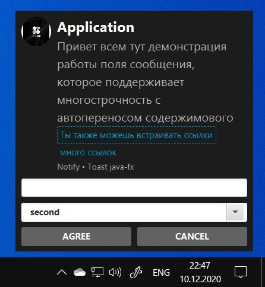
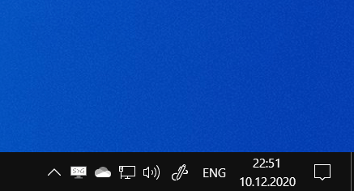
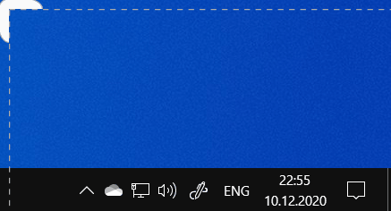
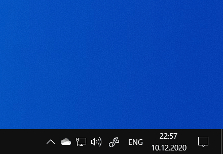

# Notify Windows
:email: Notify library to show windows toast

Сделано на Java, версия SDK: 15 и JavaFX: 11.

# Examples:
*First of all, we create an instance of our class*
```
NewNotifyJava.Builder notifyJava = new NewNotifyJava.Builder(primaryStage);
```
---------------------
As the saying goes: "all inclusive!"

<a href="url"></a>
```
notifyJava.title("Application")
                .message("Привет всем тут демонстрация работы поля сообщения, которое поддерживает многострочность с автопереносом содержимового")
                .messageLinkBrowser("Ты также можешь встраивать ссылки", "https://ssereda.ru")
                .messageLinkBrowser("много ссылок", "https://www.google.com")
                .appName("Notify")
                .addAttributionText("Toast java-fx")
                .iconBorder(NewNotifyJava.Border.CIRCLE)
                .position(NewNotifyJava.Position.RIGHT_BOTTOM)
                .waitTime(NewNotifyJava.Durability.NEVER)
                .backgroundOpacity(1)
                .addInputTextBox()
                .setComboBox("second", "first", "second", "third", "four", "five", "six")
                .setPositiveButton("AGREE", event -> {
                    System.out.println(notifyJava.getValueTextField());
                    System.out.println(notifyJava.getValueComboBox());
                })
                .setNegativeButton("CANCEL", event -> System.out.println("negative"))
                .iconPathURL("https://softboxmarket.com/images/thumbnails/618/540/detailed/3/official-bts-wings-2nd-album-cd-poster-po_00.jpg")
                .changeTransition(NewNotifyJava.Animation.TRANSPARENT)
                .closeOnClick()
                .build();
```
---------------------
There are 2 types of animation:
### First method (Disappears from the screen)
<a href="url"></a>
### Second method (Transparent)
<a href="url"></a>

---------------------
There is an implementation of "input string" and " drop-down list"

<a href="url"></a>

***The project was released for my University course***

##### My contacts:
1. [Telegram](https://tgmsg.ru/princepepper)
2. [Вконтакте](https://vk.com/princepepper)
3. [Instargam](https://www.instagram.com/prince_pepper_official/?hl=ru)
4. <sereda.wk@gmail.com>
